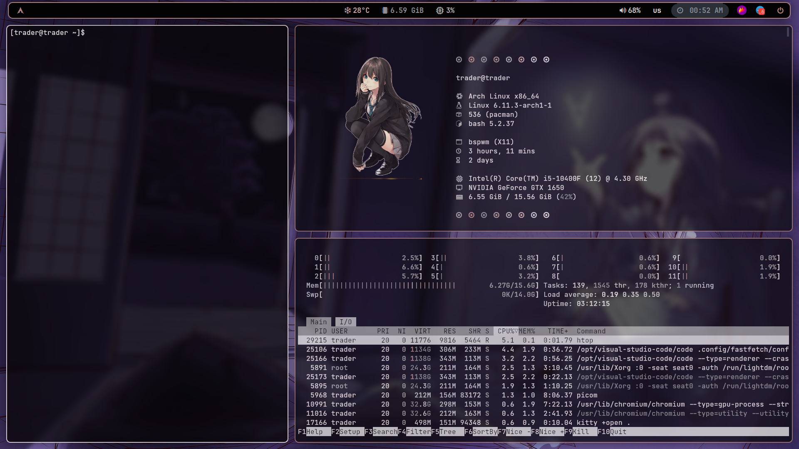

# Установка
___

## Необходимые пакеты:

- **bspwm** — оконный менеджер.
- **sxhkd** — менеджер горячих клавиш для bspwm.
- **picom** — композитор для окон.
- **kitty** — быстрый терминал с аппаратным ускорением.
- **fastfetch** — утилита для отображения системной информации в терминале.
- **polybar** — настраиваемая панель для рабочего стола.
- **xrandr** — утилита для настройки дисплеев.
- **arandr** — графическая оболочка для xrandr.
- **python-pywal** — утилита для генерации цветовых схем.
- **feh** — утилита для отображения изображений, часто используется для установки обоев.
- **pavucontrol** — утилита для управления настройками звука.
- **rofi** — менеджер приложений и файлов.
- **flameshot** — утилита для создания скриншотов.
- **pipewire** — аудиосервер, замена PulseAudio.
- **chromium** — веб-браузер.
- **telegram-desktop** — десктопная версия мессенджера Telegram.
- **Visual Studio Code** — популярный текстовый редактор с поддержкой расширений и функций для разработки.
___


## Установка

### Установка пакетов через pacman

Для установки пакетов, используйте следующую команду:

```
sudo pacman -S feh kitty python-pywal fastfetch pavucontrol picom rofi bspwm sxhkd chromium flameshot pipewire polybar telegram-desktop xrandr arandr
```

### Установка пакетов через yay

Установка AUR (Arch User Repository):

```
git clone https://aur.archlinux.org/yay.git
cd yay
makepkg -si
```

Установка Visual Studio Code:

```
sudo yay -S visual-studio-code-bin
```
___


## Галерея



